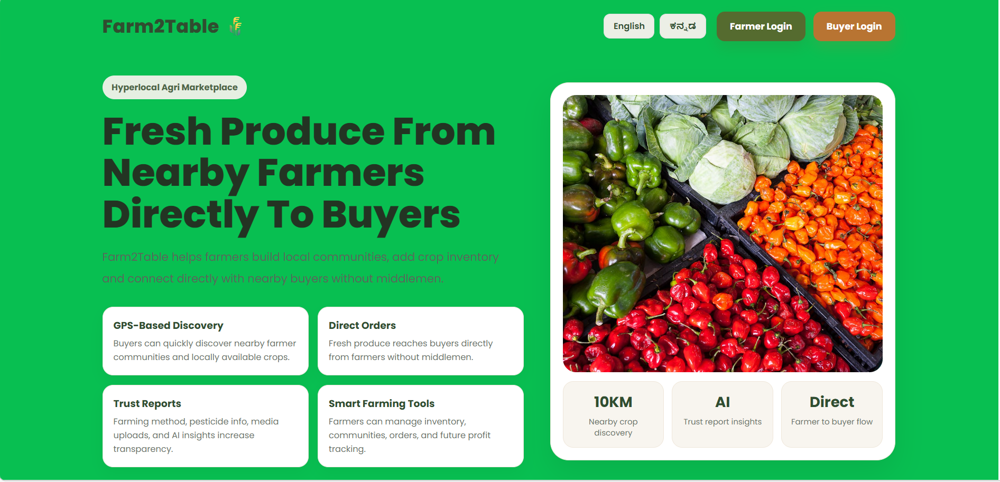
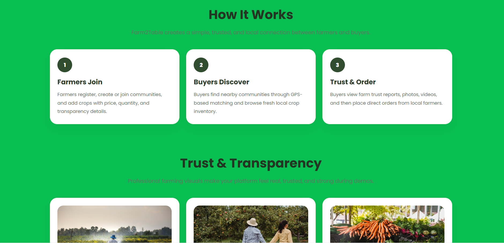
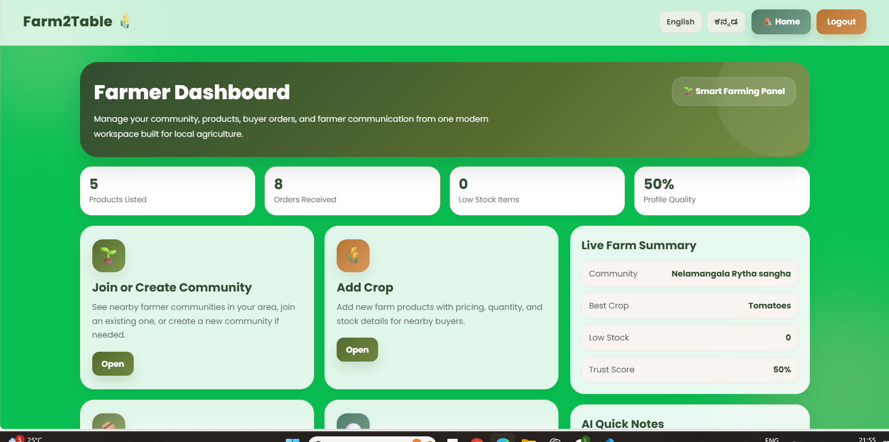
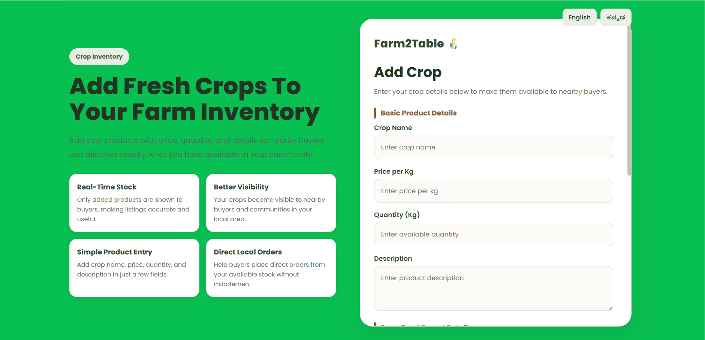
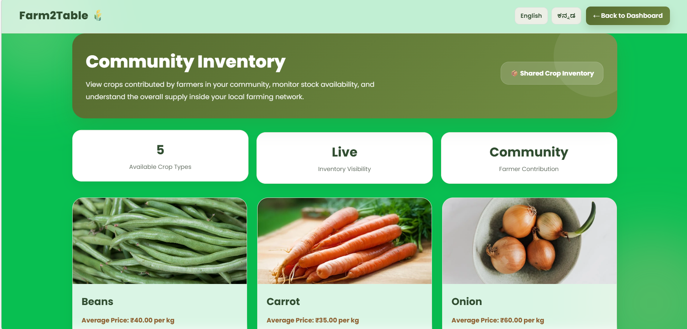
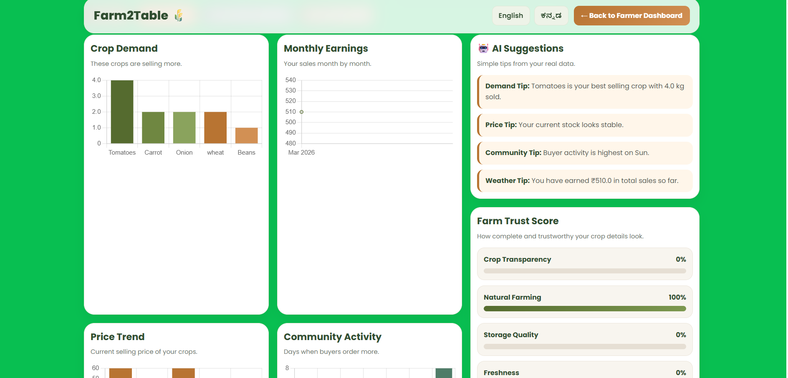
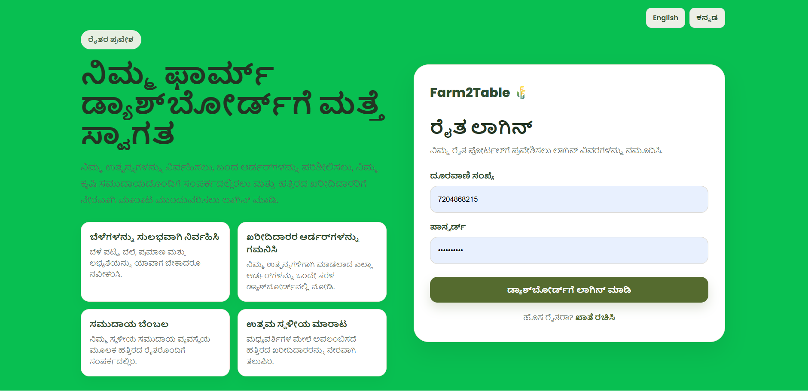

Farm2Table is a web application that connects *farmers directly with nearby buyers without middlemen*.  
The platform allows farmers to list crops, manage inventory, and sell products within a *10KM radius*.

---

# 🚀 Features

---

## 🏠 Home Page

The home page allows users to choose whether they want to log in as a *Farmer* or a *Buyer*.  
It serves as the entry point of the platform.

  
  

---

## 👨‍🌾 Farmer Dashboard

The farmer dashboard allows farmers to manage their farming activities such as adding crops, managing orders, viewing community inventory, and accessing AI insights.

  

---

## 🌾 Add Crop

Farmers can upload crops with details including:

- Crop name  
- Price per kilogram  
- Available quantity  
- Crop image  

This helps buyers view and purchase available farm products.

  

---

## 📦 Community Inventory

The community inventory shows all crops uploaded by farmers within the same community.  
This allows farmers and buyers to view available products and quantities.

  

---

## 💬 Farmer Community Chat

Farmers within the same community can communicate with each other to share farming knowledge, discuss crop demand, and coordinate selling strategies.

---

## 🛒 Buyer Dashboard

Buyers can explore crops available within a *10KM radius*, view product details, and place orders directly with farmers.

  

---

## 🤖 AI Farming Insights

The AI Insights dashboard provides farmers with useful analytics such as:

- Crop demand trends  
- Price trends  
- Community activity  
- Profit summaries  

These insights help farmers make better decisions.

  

---

# 🌐 Multilingual Support

The platform supports multiple languages to make it accessible to local farmers.

Supported languages:

- English  
- Kannada

  

---

# 🛠 Technology Stack

*Backend*
- Python
- Flask

*Frontend*
- HTML
- CSS
- JavaScript

*Database*
- SQLite

*Visualization*
- Chart.js

*Version Control*
- Git
- GitHub

---
